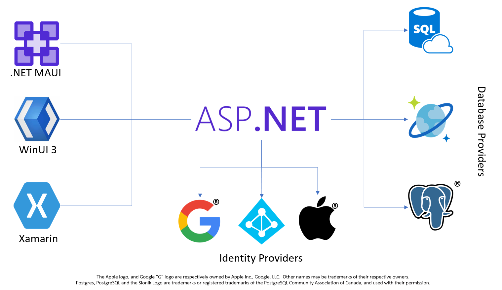

# About Azure Mobile Apps

The Microsoft Datasync Framework (also known as Azure Mobile Apps) gives enterprise developers and system integrators a mobile-application development platform that's highly scalable and globally available.  The framework provides your mobile app with:

* Authentication
* Data query
* Offline data synchronization

Azure Mobile Apps is designed to work with Azure App Service. Since it's based on ASP.NET 6, it can also be run as a container in Azure Container Apps or Azure Kubernetes Service.

## Why Mobile Apps?

With the Mobile Apps SDKs, you can:

* **Build native and cross-platform apps**: Build cloud-enabled apps for Android, iOS, or Windows using native SDKs.
* **Connect to your enterprise systems**: Authenticate your users with Azure Active Directory, and connect to enterprise data stores.
* **Build offline-ready apps with data sync**: Make your mobile workforce more productive by building apps that work offline. Use Azure Mobile Apps to sync data in the background.

## Azure Mobile Apps features

The following features are important to cloud-enabled mobile development:

* **Authentication and authorization**: Use Azure Mobile Apps to sign-in users using social and enterprise provides.  Azure App Service supports Azure Active Directory, Facebook, Google, Microsoft, Twitter, and OpenID Connect.  You can also use any other header-based authorization scheme.

* **Data access**: Mobile Apps provides a mobile-friendly OData v4 data source that's linked to a compatible database via Entity Framework Core. Any compatible database can be used, including Azure SQL, Cosmos DB, or an on-premise Microsoft SQL Server.

* **Offline sync**: Build robust and responsive mobile applications that operate with an offline dataset. You can sync this dataset automatically with service, and handle conflicts with ease.

* **Client SDKs**: There's a complete set of client SDKs that cover cross-platform development ([.NET](howto/client/dotnet.md), and [Apache Cordova](howto/client/cordova.md)). Each client SDK is available with an MIT license and is open-source.

## Azure App Service features

The following platform features are useful for mobile production sites:

* [**Autoscaling**](/azure/app-service/manage-scale-up): With App Service, you can quickly scale up or scale out to handle any incoming customer load. Manually select the number and size of VMs, or set up autoscaling to scale your service based on load or schedule.

* [**Staging environments**](/azure/app-service/deploy-staging-slots): App Service can run multiple versions of your site. You can perform A/B testing and do in-place staging of a new mobile service.

* [**Continuous deployment**](/azure/app-service/deploy-continuous-deployment): App Service can integrate with common _source control management_ (SCM) systems, allowing you to easily deploy a new version of your mobile service.

* [**Virtual networking**](/azure/app-service/web-sites-integrate-with-vnet): App Service can connect to on-premises resources by using virtual network, Azure ExpressRoute, or hybrid connections.

* [**Isolated and dedicated environments**](/azure/app-service/environment/intro): For securely running Azure App Service apps, you can run App Service in a fully isolated and dedicated environment. This environment is ideal for application workloads that require high scale, isolation, or secure network access.

## Next steps

To get started with Azure Mobile Apps, complete a Getting Started tutorial. The tutorial covers the basics of producing a mobile service and client of your choice. It also covers integrating authentication and offline sync. You can complete the tutorial multiple times, once for each client application.

* Windows App Development
  * [Universal Windows Platform (UWP)](quickstarts/uwp/index.md)
  * [Windows Presentation Frameworks (WPF)](quickstarts/wpf/index.md)
  * [Windows App SDK (WinUI 3)](quickstarts/winui/index.md)
* Native Mobile App Development
  * [Xamarin (Android)](quickstarts/xamarin-android/index.md)
  * [Xamarin (iOS)](quickstarts/xamarin-ios/index.md)
* Cross-platform Mobile App Development
  * [.NET MAUI](quickstarts/maui/index.md)
  * [Avalonia](quickstarts/avalonia/index.md)
  * [Xamarin (Forms)](quickstarts/xamarin-forms/index.md)
